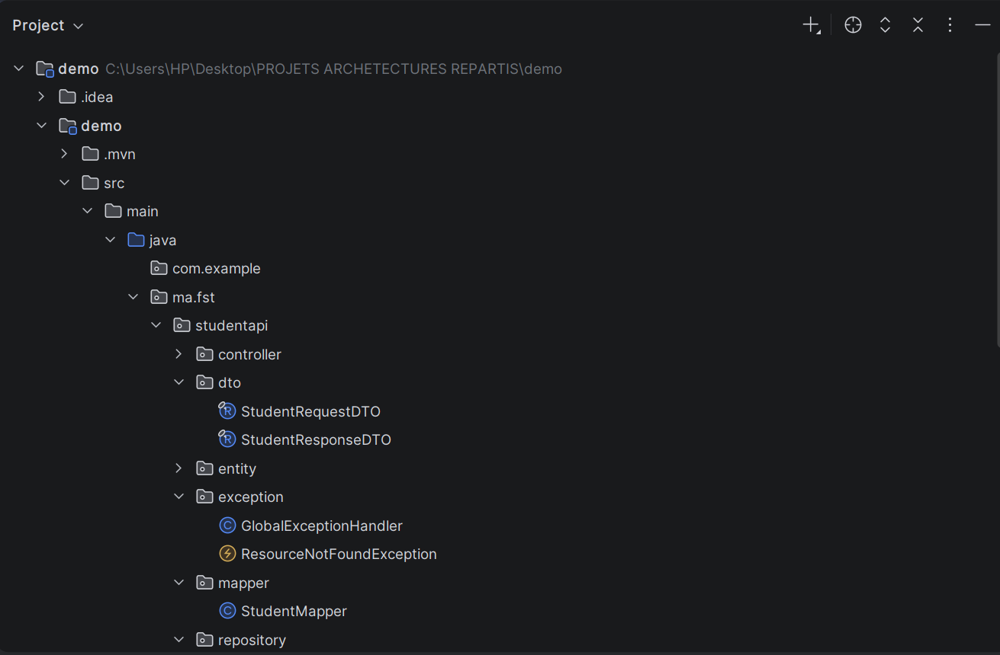
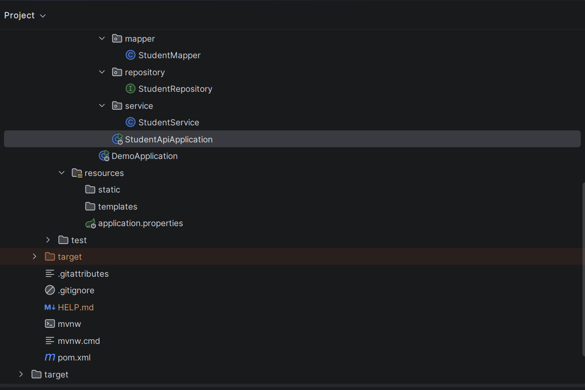

# TP 8 — Spring Boot, MySQL, DTO, Record, Mapper, API REST et Swagger

## 📚 Cours
Développement JakartaEE : Spring

---

## Contexte

#### Ce TP s'inscrit dans la continuité du cours Développement JakartaEE avec Spring. Il permet de créer une API REST complète pour gérer des étudiants, avec une architecture claire, l’utilisation de DTO et de record, un mapper manuel, et une documentation interactive via Swagger UI.  
#### Le but est de comprendre la circulation des données entre les couches et d’appliquer de bonnes pratiques backend professionnelles.

---

## Objectifs

#### - Créer une API REST fonctionnelle pour gérer des étudiants  
#### - Configurer une base MySQL et y persister les données via Spring Data JPA  
#### - Séparer entité, DTO et mapper pour organiser proprement le backend  
#### - Gérer les validations et les exceptions de manière centralisée  
#### - Tester tous les endpoints via Swagger UI  

---

## Technologies utilisées

#### - Java 17  
#### - Spring Boot 3  
#### - Spring Web  
#### - Spring Data JPA  
#### - MySQL  
#### - Jakarta Validation  
#### - Swagger / OpenAPI  
#### - Maven  
#### - Java record  

---

## 📁 Structure du projet

## Installation et lancement

### - Cloner le projet :

 git clone [https://github.com/TON_USERNAME/studentapi.git](https://github.com/nassima-brina/TP-8-Spring-Boot-MySQL-DTO-Record-Mapper-API-REST-et-Swagger/tree/main)
#### - Entrer dans le dossier :
cd studentapi
#### - Lancer le projet avec Maven :
mvn spring-boot:run
- L'application démarre sur :
http://localhost:8085

## Composants créés
#### Student.java :

#### Entité JPA représentant un étudiant avec id, prénom, nom, email, filière et âge.

### StudentRepository.java

#### Repository Spring Data JPA pour accéder aux données en base.
#### Méthodes automatiques : save, findAll, findById, delete, existsById.

### StudentRequestDTO.java

#### Record DTO pour les requêtes POST/PUT avec validation des champs.

### StudentResponseDTO.java

#### Record DTO pour les réponses API, contient l’id et toutes les informations de l’étudiant.

### StudentMapper.java

#### Mapper manuel entre l’entité Student et les DTO.
#### Méthodes : toEntity, toResponseDTO, updateEntityFromDTO.

### StudentService.java

#### Service métier gérant la logique CRUD.
#### Méthodes : addStudent, getAllStudents, getStudentById, updateStudent, deleteStudent.

### StudentController.java

#### Contrôleur REST exposant les endpoints :
#### - POST /api/students
#### - GET /api/students
#### - GET /api/students/{id}
#### - PUT /api/students/{id}
#### - DELETE /api/students/{id}

### ResourceNotFoundException.java & GlobalExceptionHandler.java
#### Gestion centralisée des exceptions et renvoi de réponses claires avec statut HTTP approprié.

## Aperçu de l'application
<video width="480" controls>
  <source src="demo.mp4" type="video/mp4">
  Votre navigateur ne supporte pas la vidéo.
</video>

#### - Ajouter un étudiant via POST /api/students avec un JSON 

#### - Modifier un étudiant via PUT /api/students/{id}

#### -Lister tous les étudiants avec GET /api/students

#### - Rechercher par id avec GET /api/students/{id}

#### - Supprimer un étudiant avec DELETE /api/students/{id}

#### Swagger UI : http://localhost:8085/swagger-ui/index.html

## Conclusion

#### Ce TP a permis de créer une API REST complète avec Spring Boot et MySQL, structurée avec entités, DTO, mapper et service, avec validation, gestion des erreurs et documentation Swagger.
#### L’application est fonctionnelle et prête à être consommée par un frontend ou une application mobile, suivant les bonnes pratiques backend.
